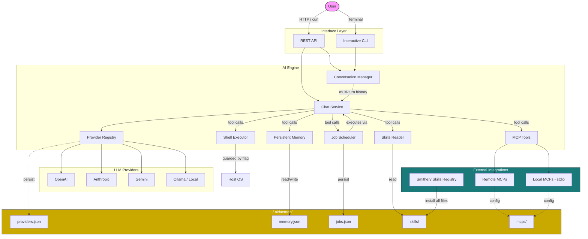

# AI Daemon

A lightweight AI framework built on Spring Boot 4 and Spring AI. Connect any LLM provider, extend capabilities with skills and MCPs, schedule autonomous jobs, and interact through REST or terminal -- all from a single self-hosted service.

## Architecture



## Features

- **Multi-provider** -- OpenAI, Anthropic, Gemini, Ollama. Add/remove providers at runtime with API key persistence.
- **Conversations** -- Stateful multi-turn sessions with full chat history.
- **Persistent memory** -- AI can save and recall information across sessions via `memory.json`.
- **Skills** -- Drop instruction files into `~/.aidaemon/skills/` or install from [Smithery](https://smithery.ai) via REST endpoint. The AI reads them for domain-specific context.
- **MCP support** -- Connect remote (Streamable HTTP, SSE) and local (stdio) MCP servers. Drop JSON configs into `~/.aidaemon/mcps/` and reload.
- **Scheduled jobs** -- AI creates cron jobs (recurring or one-time) that autonomously execute instructions on schedule. AI can also list and cancel them.
- **Shell access** -- Optionally allow the AI to execute host commands (git, docker, curl, etc.). Controlled by a global toggle endpoint.
- **Interactive CLI** -- Terminal-based chat with provider selection, conversation management, and shell toggle.

## Prerequisites

- Java 25+
- Maven (or use the included `mvnw` wrapper)

## Quick Start

```bash
# Clone and build
git clone <repo-url>
cd aidaemon
./mvnw spring-boot:run
```

On Windows PowerShell:
```powershell
.\mvnw.cmd spring-boot:run
```

The server starts on `http://localhost:8080`.

### 1. Register a Provider

```bash
curl -X POST http://localhost:8080/api/providers \
  -H "Content-Type: application/json" \
  -d '{"name":"my-gpt","type":"OPENAI","apiKey":"...","model":"gpt-4o"}'
```

Supported types: `OPENAI`, `ANTHROPIC`, `GEMINI`, `OLLAMA`

For Ollama (no API key needed):
```bash
curl -X POST http://localhost:8080/api/providers \
  -H "Content-Type: application/json" \
  -d '{"name":"local-llama","type":"OLLAMA","baseUrl":"http://localhost:11434","model":"llama3"}'
```

### 2. Chat (Stateless)

```bash
curl -X POST http://localhost:8080/api/chat/{providerId} \
  -H "Content-Type: application/json" \
  -d '{"messages":[{"role":"user","content":"Hello!"}]}'
```

### 3. Conversations (Stateful)

```bash
# Create a conversation
curl -X POST http://localhost:8080/api/conversations \
  -H "Content-Type: application/json" \
  -d '{"providerId":"<id>"}'

# Send messages (history is maintained server-side)
curl -X POST http://localhost:8080/api/conversations/{id}/messages \
  -H "Content-Type: application/json" \
  -d '{"message":"What did I just ask you?"}'
```

### 4. Interactive CLI

```bash
./mvnw spring-boot:run -Dspring-boot.run.profiles=cli
```

On Windows PowerShell:
```powershell
.\mvnw.cmd spring-boot:run "-Dspring-boot.run.profiles=cli"
```

Commands inside CLI: `/quit`, `/new` (new conversation), `/shell` (toggle shell access).

## Skills

Skills are folders containing a `SKILL.md` and optional resources (scripts, references, assets) that give the AI domain-specific knowledge.

**Manual install:** Drop a skill folder into `~/.aidaemon/skills/`.

**Install from Smithery:**
```bash
curl -X POST http://localhost:8080/api/skills/install/anthropics/skill-creator
```
This downloads all files (SKILL.md, scripts, references, etc.) from the skill's GitHub repository.

**Manage skills:**
```bash
# List installed skills
curl http://localhost:8080/api/skills

# List files in a skill
curl http://localhost:8080/api/skills/skill-creator/files

# Remove a skill
curl -X DELETE http://localhost:8080/api/skills/skill-creator
```

## MCP Servers

Create JSON config files in `~/.aidaemon/mcps/`.

**Remote (Streamable HTTP):**
```json
{
  "name": "github",
  "type": "REMOTE",
  "url": "https://api.githubcopilot.com/mcp/",
  "headers": {
    "Authorization": "Bearer <token>"
  }
}
```

**Remote (Legacy SSE):**
```json
{
  "name": "my-sse-server",
  "type": "SSE",
  "url": "https://example.com/mcp/sse"
}
```

**Local (stdio):**
```json
{
  "name": "aviation",
  "type": "LOCAL",
  "command": "npx",
  "args": ["-y", "aviationstack-mcp-server"],
  "env": {
    "AVIATIONSTACK_API_KEY": "<key>"
  }
}
```

```bash
# List connected MCPs
curl http://localhost:8080/api/mcps

# Reload after adding/editing config files
curl -X POST http://localhost:8080/api/mcps/reload
```

## Shell Access

Shell access is **disabled by default**. Toggle it at runtime:

```bash
# Enable
curl -X POST http://localhost:8080/api/shell-access/enable

# Disable
curl -X POST http://localhost:8080/api/shell-access/disable

# Check status
curl http://localhost:8080/api/shell-access
```

When enabled, the AI can execute arbitrary commands on the host system.

## Scheduled Jobs

The AI can create cron jobs via tool calls. You can also manage them through REST:

```bash
# List all jobs
curl http://localhost:8080/api/jobs

# View execution results
curl http://localhost:8080/api/jobs/results

# Cancel a job
curl -X DELETE http://localhost:8080/api/jobs/{id}
```

## API Reference

| Method | Endpoint | Description |
|--------|----------|-------------|
| `GET` | `/api/providers` | List registered providers |
| `POST` | `/api/providers` | Register a new provider |
| `DELETE` | `/api/providers/{id}` | Remove a provider |
| `POST` | `/api/chat/{providerId}` | Stateless chat |
| `POST` | `/api/conversations` | Create a conversation |
| `POST` | `/api/conversations/{id}/messages` | Send a message |
| `GET` | `/api/conversations` | List conversations |
| `DELETE` | `/api/conversations/{id}` | Delete a conversation |
| `GET` | `/api/skills` | List installed skills |
| `GET` | `/api/skills/{name}/files` | List skill files |
| `POST` | `/api/skills/install/{namespace}/{slug}` | Install from Smithery |
| `DELETE` | `/api/skills/{name}` | Remove a skill |
| `GET` | `/api/mcps` | List connected MCP servers |
| `POST` | `/api/mcps/reload` | Reload MCP configurations |
| `GET` | `/api/shell-access` | Shell access status |
| `POST` | `/api/shell-access/enable` | Enable shell access |
| `POST` | `/api/shell-access/disable` | Disable shell access |
| `GET` | `/api/jobs` | List scheduled jobs |
| `GET` | `/api/jobs/results` | View job execution results |
| `DELETE` | `/api/jobs/{id}` | Cancel a job |

## Data Directory

All persistent data lives in `~/.aidaemon/`:

```
~/.aidaemon/
├── providers.json     # Registered LLM providers and API keys
├── memory.json        # AI's persistent memory
├── jobs.json          # Scheduled job definitions
├── skills/            # Skill folders (SKILL.md + resources)
└── mcps/              # MCP server config JSON files
```

## Caution

- **API keys are stored in plain text** in `~/.aidaemon/providers.json`. Protect this file accordingly.
- **Shell access grants the AI full command execution** on your machine. Only enable it in trusted environments and disable it when not needed.
- **Scheduled jobs run autonomously** using your configured provider and consume API tokens. Monitor your jobs and cancel any you no longer need.
- **MCP servers may expose powerful capabilities** (file system access, API calls, etc.). Review MCP configurations before connecting them.
- This project uses Spring AI milestone releases which may have breaking changes between versions.

## Contributing

Contributions are welcome! Whether it's bug fixes, new provider integrations, additional tools, or documentation improvements -- all PRs are appreciated.

If you have ideas for new features or find issues, please open a GitHub issue to discuss before submitting a PR.
